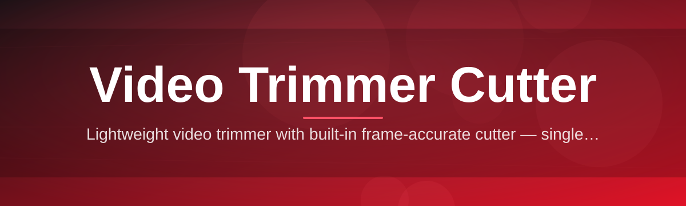

# video-trimmer-cutter-editor ✂️🎬

  

*Trim, cut, and reshape your clips in seconds — no timeline degree required.*

## 🌱 Overview

Every video starts too long. There's the throat-clear before the good take, the dead air after the punchline, the three minutes of "let me just find the right spot" in a screen recording. **video-trimmer-cutter-editor** exists to solve that one, extremely universal problem: getting from "raw footage" to "the part that matters" without opening a bloated NLE, waiting for a project file to render, or fighting a UI built for Hollywood colorists.

This is a **Video Trimmer Cutter** built for the other 99% of video work — the quick export for a group chat, the clean clip for a course module, the highlight pulled from a two-hour stream. It's a focused desktop tool for Windows that treats trimming and cutting as a first-class task instead of a buried submenu three clicks deep in a professional suite. Frame-accurate scrubbing, instant previews, and lossless-when-possible exports are the whole point — not a footnote.

Who's this for? Streamers clipping highlights, teachers prepping lecture snippets, indie creators batch-processing footage, support teams trimming screen recordings for bug reports, and anyone who has ever thought *"I just need to cut this down, why is this so hard?"* If that's you, welcome home. 🏡

  

---

## 🚀 What It Actually Does

> [!TIP]
> Every feature below was designed around one question: *"does this get the user to a finished clip faster?"* If it didn't, it got cut. Ironic, we know.

- **Frame-precise trimming** — drag the in/out handles and land exactly on the frame you want, not "somewhere near it." The scrubber snaps to real frame boundaries, so your cut point is deterministic, not a guess.

- **Multi-segment cutting** — mark several ranges in a single pass and export them as one stitched clip or as separate files. Think of it as slicing a loaf of bread and choosing which slices actually make it to the plate.

- **Lossless-first export pipeline** — when the codec and container allow it, cuts are performed on stream copy so there's no re-encode, no quality loss, no waiting around for a progress bar that lies to you.

- **Live waveform + thumbnail scrubbing** — the timeline shows audio waveforms and frame thumbnails together, so you can find "the loud part" or "the visual cue" without playing back the whole file.

- **Batch queue mode** — drop in a folder of clips, define a trim template, and let the tool chew through the whole set while you go make coffee. ☕

- **Aspect-ratio & crop presets** — quick presets for vertical, square, and widescreen exports, because the same clip rarely lives on just one platform anymore.

- **Undo-safe non-destructive editing** — the source file is never touched until you explicitly export. Experiment freely; nothing is permanent until you say so.

- **Format-flexible I/O** — reads and writes the common containers and codecs your footage actually comes in, so you're not stuck converting things twice.

---

## 🧭 Getting Started in Four Steps

> [!NOTE]
> No package managers, no command line, no dependency hunting. This is a standalone Windows tool — download it, run it, cut something.

1. **Visit the landing page** using the download button above (or below — we're not shy about it).
2. **Grab the latest build** for Windows from the page.
3. **Launch the executable** — there's no installer wizard to babysit, just open it and you're in the editor.
4. **Drop in a video**, drag your in/out points, hit export, and go admire your newly trimmed masterpiece.

---

## 💻 System Requirements

| Requirement | Details |
|---|---|
| OS | Windows 10 or Windows 11 (64-bit) |
| Dependencies | None — fully standalone |
| Storage | Minimal install footprint, scales with your media cache |
| GPU | Optional — accelerates preview scrubbing and re-encodes if available |
| Internet | Only needed to download the app itself |

> [!IMPORTANT]
> This tool is Windows-only for now. There's no macOS or Linux build in this release cycle — please don't file an issue asking why your Linux box won't run the `.exe`. (We already know. 😅)

---

## ⚙️ How It Works

The internal flow is intentionally simple — complexity is the enemy of a fast trim:

1. **Load** — the app reads container/codec metadata without fully decoding the file, so opening even large videos feels instant.
2. **Mark** — you set in/out points on a scrubbable timeline backed by waveform and thumbnail previews.
3. **Preview** — a lightweight render pass lets you confirm the cut looks and sounds right before committing.
4. **Cut** — the engine decides between stream-copy (lossless, fast) or re-encode (when format constraints require it).
5. **Export** — your finished clip lands wherever you tell it to, ready to upload, send, or archive.

---

## 🩹 Troubleshooting

**Q: My export finished instantly — did it actually work?**
A: Probably yes! That's the lossless stream-copy path doing its job. No re-encode needed means near-instant exports for compatible formats.

**Q: The preview looks choppy but the exported file is fine — what gives?**
A: Preview scrubbing uses a lightweight decode pass for speed. The final export always renders at full quality regardless of preview smoothness.

**Q: Why did my trim get slightly re-encoded instead of a clean cut?**
A: Some codecs only allow cuts on keyframes. If your in/out point wasn't on one, the app re-encodes a tiny segment around the cut to keep it frame-accurate.

**Q: The app won't open a specific file — is it corrupted?**
A: Not necessarily. Check that the container/codec combo is supported (see the format table in the app). Oddly muxed files from some recorders can confuse metadata readers.

**Q: Batch mode processed some files but skipped others — why?**
A: Files that don't match your trim template's expected duration or resolution are skipped with a warning in the queue log rather than silently failing.

**Q: Can I recover my original file after cutting?**
A: Yes — source files are never modified. Your original stays untouched on disk; only the exported copy is new.

---

## 🎛️ UI, UX & Little Details That Matter

<strong>⌨️ Keyboard shortcuts</strong>

| Action | Shortcut |
|---|---|
| Set in-point | `I` |
| Set out-point | `O` |
| Play / pause | `Space` |
| Nudge frame back / forward | `,` / `.` |
| Jump 1 second back / forward | `←` / `→` |
| Split at playhead | `S` |
| Export | `Ctrl + E` |
| Undo / Redo | `Ctrl + Z` / `Ctrl + Y` |

<strong>🎨 Themes & appearance</strong>

- Dark mode (default) — easy on the eyes for long editing sessions
- Light mode — for bright rooms and daylight editing
- Compact layout toggle for smaller displays or side-by-side windows

<strong>⚡ Settings worth knowing about</strong>

- Configurable autosave interval for your project markers
- Adjustable waveform resolution (trade render time for detail)
- Default export folder pinning so you stop hunting for output files

  

---

## 🤝 Contributing & Community

Got an idea, a bug, or a feature that would make your daily trim-and-cut workflow smoother? We want to hear it.

> [!TIP]
> The best issues include a short description of your workflow, the file format involved, and what you *expected* versus what happened. It turns a vague bug report into a fixable one in about thirty seconds.

- Open an issue to report bugs or request features
- Star the repo if this tool saved you time — it genuinely helps visibility
- Share clips or workflows you've built with it; we love seeing this thing get used in the wild

> [!WARNING]
> Please don't open issues asking for features that circumvent content protections or platform restrictions. This is a straightforward **Video Trimmer Cutter** — keep requests focused on trimming, cutting, and exporting your own footage.

---

## 📜 License

Released under the [MIT License](LICENSE), 2026. Use it, fork it, build on it — just carry the license along.

---

## ⚠️ Disclaimer

This software is provided "as is," without warranty of any kind. Always keep backups of your original footage before running batch operations. The maintainers aren't responsible for lost weekends spent perfecting a five-second clip — that part's on you. 😉

  

